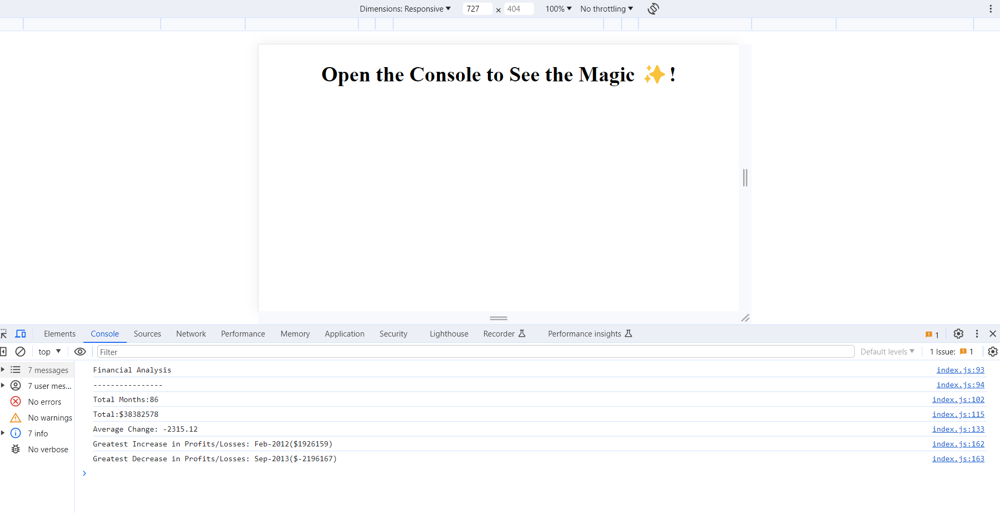

# console-finances
Fourth Challenge for Bootcamp in web-developing and UX
## Description

This was the fourth challenge for the University of Birmingham bootcamp in front-end web-developing and UX. In this challenge, I had to create a financial calculator which analysed a dataset composed of arrays with two fields: Date and Profit/Losses. The analysis had to include- the total number of months included in dataset, the net total amount of profit and losses of the entire period, the average of the changes in profit/loss, the greatest increase, and greatest decrease over the entire period. 

Guidelines for successful completition of this challenge included having a github repo, a good readMe file, and making sure that when the browser is opened our analysis matched the example provided. 

This challenge was really challenging for me! Javascript is definetely a step-up from HTML and CSS and I had to go over all my notes and access additional tutorials to really understand everything needed to complete this challenge. But what has been great is that it has now made me understand the basic of Javascript and how we can harness this language in different ways to get the same outcome. 

## Installation

N/A

## Usage

 All you need to do is open [this page](https://coding-boot-camp.github.io/full-stack/github/professional-readme-guide) in your browser. Right-click your mouse anywhere on the page and click inspect. Open the console and you should see the financial analysis like in this screenshot

md
    

    
## Credits

I read the following documentation to help me complete this challenge: 

[Read Me Guide](https://coding-boot-camp.github.io/full-stack/github/professional-readme-guide)

[For Loops](https://developer.mozilla.org/en-US/docs/Web/JavaScript/Reference/Statements/for...of)

[loops and iteration](https://developer.mozilla.org/en-US/docs/Web/JavaScript/Guide/Loops_and_iteration#for_statement/)

[Math.round()](https://developer.mozilla.org/en-US/docs/Web/JavaScript/Reference/Global_Objects/Math/round)

[array](ttps://developer.mozilla.org/en-US/docs/Web/JavaScript/Reference/Global_Objects/Array)

[if...else](https://developer.mozilla.org/en-US/docs/Web/JavaScript/Reference/Statements/if...else)

I also whatched the following tutorial videos on basic Javascript: 

[beginner Javascript by Wes Bos](https://courses.wesbos.com/account)

